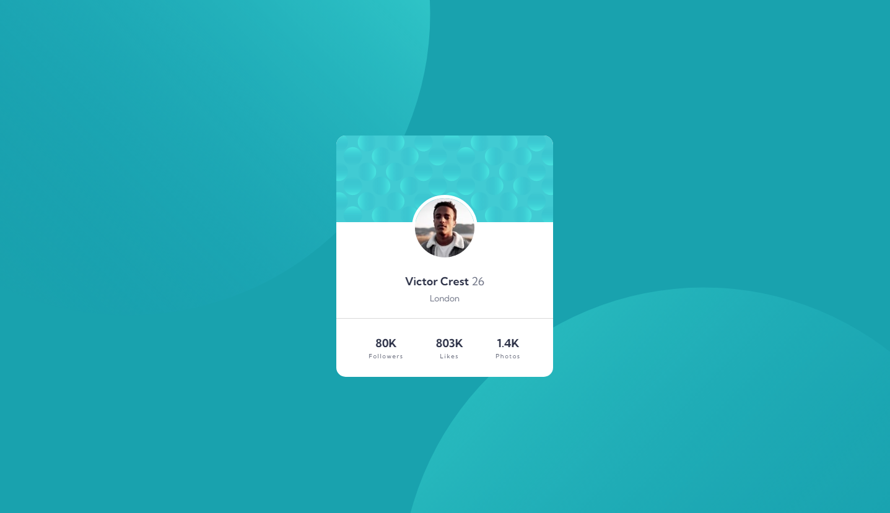

# Frontend Mentor - Profile card component solution

This is a solution to the [Profile card component challenge on Frontend Mentor](https://www.frontendmentor.io/challenges/profile-card-component-cfArpWshJ). Frontend Mentor challenges help you improve your coding skills by building realistic projects. 

## Table of contents

- [Overview](#overview)
  - [The challenge](#the-challenge)
  - [Screenshot](#screenshot)
  - [Links](#links)
- [My process](#my-process)
  - [Built with](#built-with)
  - [What I learned](#what-i-learned)
- [Author](#author)

## Overview

### The challenge

- Build out the project to the designs provided

### Screenshot



### Links

- Solution URL: [Add solution URL here](https://github.com/victorsonet/victorsonet.github.io)
- Live Site URL: [Add live site URL here](https://victorsonet.github.io/)

## My process

### Built with

- Semantic HTML5 markup
- CSS custom properties
- Flexbox

### What I learned

I learned to use transform better and to position the background svgs!

```css
body::before {
    content: '';
    position: absolute;
    height: 100%;
    width: 100%;
    top: -75%;
    left: -30.5%;
    background: url(../images/bg-pattern-top.svg) no-repeat;
    transform: rotate(90deg) rotateY(180deg);
    z-index: -1;
  }
  
  body::after {
    content: '';
    position: absolute;
    height: 100%;
    width: 100%;
    background: url(../images/bg-pattern-bottom.svg) no-repeat;
    bottom: -56%;
    right: -45%;
    z-index: 0;
  }
```

## Author

- Website - [Viktor Kovács](https://victorsonet.github.io/)
- Frontend Mentor - [@victorsonet](https://www.frontendmentor.io/profile/victorsonet)
- Twitter - [@GMLvictorsoN](https://twitter.com/GMLvictorsoN)
